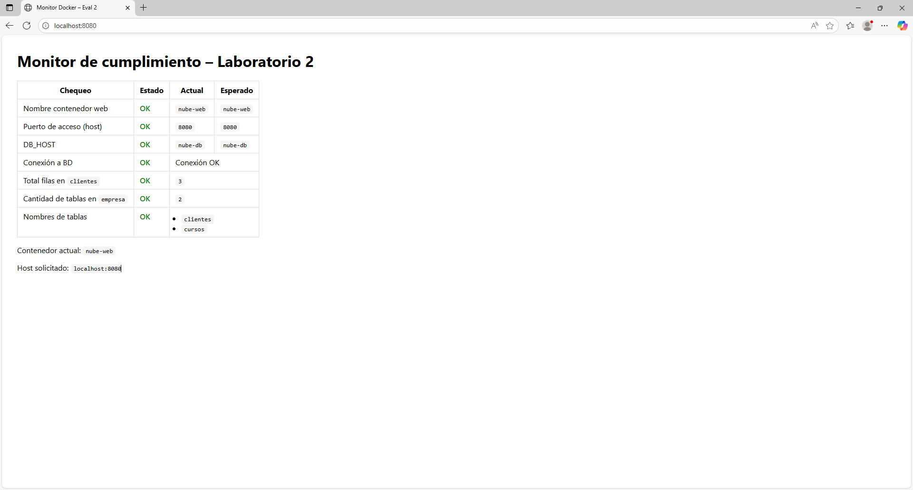

# Evaluación Computación en la nube (Eva 2)
### Nombre: Jorge Moncada

### 🐋 Ejecución de comando (docker compose up -d --build)

### 🐋 Ejecución de comando (docker compose ps)

### 🐋 Ejecución de comando (docker exec -it nube-db mariadb -u appuser -papppass empresa -D nube-bd)

### 🐋 Creación de la segunda tabla "cursos" dentro de la base de datos "empresa"

### 🐋 Insert en la tabla "cursos"

### 🐋 Comprobar localhost:8080

